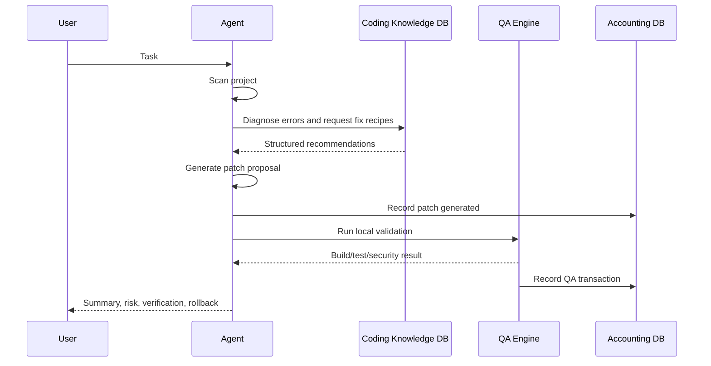

# Local AI Agent

The Local AI Coding Agent is the worker layer of the ecosystem. It is not the same component as the Coding Knowledge DB. The agent consumes the database to make better plans, generate safer patches, and verify work locally.

## Core Workflow



## Required Agent Capabilities

- Project scanning and fingerprinting.
- Local LLM integration through Ollama or equivalent loopback service.
- Querying Coding Knowledge DB by keyword, error, framework, project type, and QA context.
- Patch generation with explicit risk score and rollback plan.
- QA orchestration for build, test, security, dependency, startup, and regression checks.
- Event emission to the accounting/governance system.

## Machine-Readable Recommendation Contract

Knowledge DB responses should prefer JSON:

```json
{
  "diagnosis": {
    "rootCause": "Missing dependency",
    "confidence": 0.91
  },
  "recommendedFixes": [],
  "relatedExamples": [],
  "filesToInspect": [],
  "verificationCommands": [],
  "rollbackPlan": [],
  "riskAnalysis": {}
}
```

## Guardrails

- Do not auto-apply high-risk patches.
- Do not call external networks during runtime.
- Do not expose source, logs, prompts, or telemetry to cloud services.
- Do not store secrets in memory, reports, or generated patches.
- Return `insufficient_data` instead of inventing recommendations when local evidence is missing.
