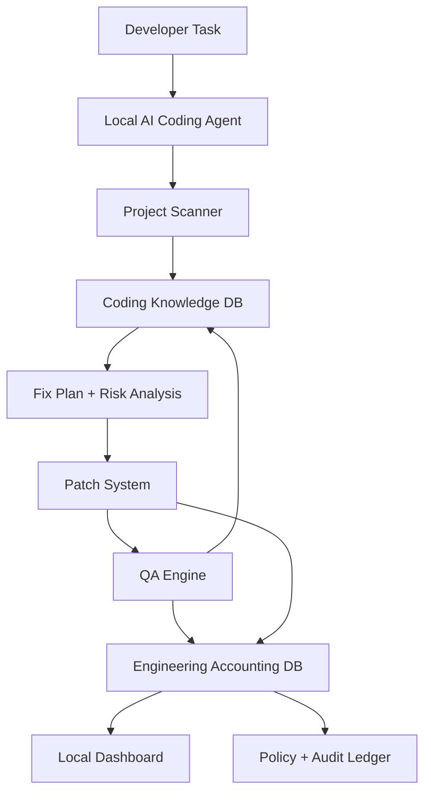

# System Overview

The target system is a local AI engineering operating system. It combines a coding agent, a coding knowledge database, an accounting and operational intelligence database, QA automation, and local governance controls.

## Components

## Responsibilities

- **Local AI Coding Agent** scans projects, queries local knowledge, proposes patches, and coordinates QA.
- **Coding Knowledge DB** stores error patterns, fix recipes, examples, QA checklists, framework rules, and diagnosis intelligence.
- **Engineering Accounting DB** stores operational evidence: sessions, resource usage, patches, QA runs, rollback history, model performance, and audit logs.
- **QA Engine** validates build, tests, security, regression risk, offline constraints, and startup behavior.
- **Local Dashboard** exposes system health, QA trends, risky patches, accounting summaries, and project status.
- **Governance Layer** enforces local-only networking, approval rules, retention policy, immutable audit logs, and backup/restore.

## End-to-End Flow

1. Developer asks the agent to perform a task.
2. Agent scans source and project metadata.
3. Agent queries Coding Knowledge DB for related errors, framework rules, fix recipes, and QA checklists.
4. Agent proposes a patch with files to inspect, verification commands, and rollback plan.
5. Patch ledger records lifecycle state and risk.
6. QA validates the result.
7. Accounting DB records resource cost, QA outcome, model usage, rollback events, and audit trail.
8. Knowledge DB learns from recurring failures and successful fixes.

## Architecture Decisions

- Use SQLite first for both knowledge and accounting stores.
- Keep coding knowledge separate from operational accounting.
- Keep generated runtime data separate from source.
- Prefer machine-readable JSON for agent-to-database responses.
- Treat every patch and QA run as an auditable transaction.
- Require local-only APIs and no telemetry.
