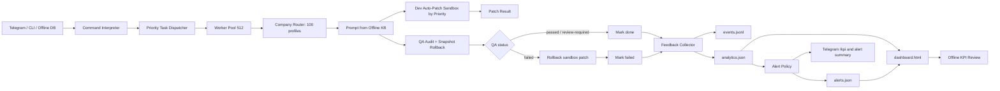

# Super Agent Offline 10.000x

## Mục tiêu

`prototypes/super_agent_offline_10000x.py` mở rộng lớp 1000x thành workflow 10.000x có priority scheduling và alert offline:

- Offline task DB: `.super-agent-10000x/task_db.json`.
- Worker pool tối đa 512 worker local.
- 100 company profiles: 8 company chiến lược + 92 overflow specialist units.
- Task được xử lý theo priority: `critical`, `high`, `medium`, `normal`, `low`.
- Dev auto-patch và QA audit chạy song song.
- Sandbox + snapshot rollback chỉ trong `.super-agent-10000x/workspace/`.
- Analytics offline: `.super-agent-10000x/analytics.json`.
- Alert offline: `.super-agent-10000x/alerts.json`.
- KPI dashboard offline: `.super-agent-10000x/dashboard.html`.
- Telegram adapter tùy chọn; `/kpi` trả KPI summary.

## Kiến trúc



## Alert policy

Prototype tạo alert khi:

- QA failed.
- Rollback executed.
- High/critical priority task cần review.
- QA fail rate >= 25% khi đã có ít nhất 4 task.
- Rollback rate >= 20% khi đã có ít nhất 4 task.

## Chạy thử

```bash
python3 prototypes/super_agent_offline_10000x.py \
  --task "Fix bug module payment" \
  --once
```

## Chạy batch priority

```bash
python3 prototypes/super_agent_offline_10000x.py \
  --task "[low] Generate monthly marketing report" \
  --task "[critical] Fix auth security regression" \
  --task "[high] Deploy payment hotfix" \
  --once
```

Task được claim theo priority trước khi dispatch vào worker pool.

## Rollback test

```bash
python3 prototypes/super_agent_offline_10000x.py \
  --task "[critical] Fix parser [qa-fail]" \
  --patch '{"target":"parser/demo.md","mode":"replace","content":"bad patch"}' \
  --once
```

Nếu QA fail, patch trong `.super-agent-10000x/workspace/` sẽ rollback tự động và alert được ghi vào `.super-agent-10000x/alerts.json`.

## Dashboard

Refresh dashboard:

```bash
python3 prototypes/super_agent_offline_10000x.py --dashboard
```

Mở file local:

```txt
.super-agent-10000x/dashboard.html
```

Dashboard hiển thị:

- Total tasks
- Throughput/hour
- Dev success rate
- QA fail rate
- Rollback rate
- High priority count
- Active alerts
- Priority mix
- Latest tasks
- Company KPI

## Monitor DB liên tục

```bash
python3 prototypes/super_agent_offline_10000x.py --monitor --interval 1
```

Task DB tối thiểu:

```json
[
  {
    "id": "task-manual-001",
    "desc": "[high] Audit deployment risk",
    "status": "pending"
  }
]
```

## Telegram adapter

Telegram không bật mặc định.

```bash
export TELEGRAM_BOT_TOKEN="..."
python3 prototypes/super_agent_offline_10000x.py --telegram --monitor
```

Lệnh Telegram:

```txt
[critical] Fix auth regression
/kpi
```

## Runtime state

```txt
.super-agent-10000x/task_db.json
.super-agent-10000x/workspace/
.super-agent-10000x/snapshots/
.super-agent-10000x/logs/events.jsonl
.super-agent-10000x/analytics.json
.super-agent-10000x/alerts.json
.super-agent-10000x/dashboard.html
```

Không commit `.super-agent-10000x/`; đây là state local.

## Verify trước khi sync main

```bash
python3 -m py_compile prototypes/super_agent_offline_10000x.py
python3 prototypes/super_agent_offline_10000x.py --task "Fix bug module payment" --once
python3 prototypes/super_agent_offline_10000x.py --task "[critical] Fix parser [qa-fail]" --patch '{"target":"parser/demo.md","mode":"replace","content":"bad patch"}' --once
python3 prototypes/super_agent_offline_10000x.py --dashboard
npm test
npm run build
npm run lint
npm run test:integration
```

## Chính sách an toàn

- Không hardcode Telegram token.
- Không patch production source từ prototype này.
- Auto-patch chỉ ghi trong `.super-agent-10000x/workspace/`.
- Snapshot được tạo trước khi sửa file đã tồn tại.
- QA fail thì rollback tự động.
- Alerts chỉ là local signal; muốn gửi realtime qua Telegram cần adapter đang chạy.
- Promotion từ sandbox vào repo thật phải đi qua approval gate riêng.
