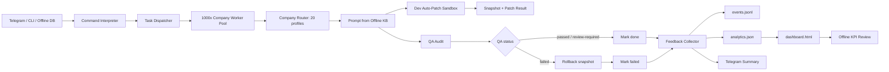

# Super Agent Offline 1000x

## Mục tiêu

`prototypes/super_agent_offline_1000x.py` mở rộng workflow 100x thành lớp 1000x có analytics và dashboard offline:

- Offline task DB: `.super-agent-1000x/task_db.json`.
- Worker pool tối đa 128 worker local.
- 20 company profiles: 8 company chiến lược + 12 overflow specialist units.
- Dev auto-patch và QA audit chạy song song.
- Sandbox + snapshot rollback chỉ trong `.super-agent-1000x/workspace/`.
- Analytics offline ở `.super-agent-1000x/analytics.json`.
- KPI dashboard offline ở `.super-agent-1000x/dashboard.html`.
- Telegram adapter tùy chọn; `/kpi` trả summary KPI qua Telegram.

## Kiến trúc



## KPI dashboard

Dashboard tạo các chỉ số:

- `total_tasks`
- `throughput_last_hour`
- `dev_success_rate`
- `qa_fail_rate`
- `rollback_rate`
- `review_required`
- KPI theo company
- KPI theo task type

## Chạy thử

```bash
python3 prototypes/super_agent_offline_1000x.py \
  --task "Fix bug module payment" \
  --once
```

Sau khi chạy, mở file:

```txt
.super-agent-1000x/dashboard.html
```

## Chạy batch multi-task

```bash
python3 prototypes/super_agent_offline_1000x.py \
  --task "Audit deployment risk" \
  --task "Generate monthly marketing report" \
  --task "Batch overflow analysis for company_09" \
  --once
```

## Rollback test

Thêm `[qa-fail]` để ép QA fail:

```bash
python3 prototypes/super_agent_offline_1000x.py \
  --task "Fix parser [qa-fail]" \
  --patch '{"target":"parser/demo.md","mode":"replace","content":"bad patch"}' \
  --once
```

Nếu QA fail, patch trong `.super-agent-1000x/workspace/` sẽ được rollback tự động.

## Monitor DB liên tục

```bash
python3 prototypes/super_agent_offline_1000x.py --monitor --interval 2
```

Task DB tối thiểu:

```json
[
  {
    "id": "task-manual-001",
    "desc": "Audit deployment risk",
    "status": "pending"
  }
]
```

## Telegram adapter

Telegram không bật mặc định.

```bash
export TELEGRAM_BOT_TOKEN="..."
python3 prototypes/super_agent_offline_1000x.py --telegram --monitor
```

Lệnh Telegram:

```txt
Fix bug module payment
/kpi
```

## Runtime state

```txt
.super-agent-1000x/task_db.json
.super-agent-1000x/workspace/
.super-agent-1000x/snapshots/
.super-agent-1000x/logs/events.jsonl
.super-agent-1000x/analytics.json
.super-agent-1000x/dashboard.html
```

Không commit `.super-agent-1000x/`; đây là state local.

## Verify trước khi sync main

```bash
python3 -m py_compile prototypes/super_agent_offline_1000x.py
python3 prototypes/super_agent_offline_1000x.py --task "Fix bug module payment" --once
python3 prototypes/super_agent_offline_1000x.py --dashboard
npm test
npm run build
npm run lint
npm run test:integration
```

## Chính sách an toàn

- Không hardcode Telegram token.
- Không patch production source từ prototype này.
- Auto-patch chỉ được ghi trong `.super-agent-1000x/workspace/`.
- Snapshot được tạo trước khi sửa file đã tồn tại.
- QA fail thì rollback tự động.
- Promotion từ sandbox vào repo thật phải đi qua approval gate riêng.

## Next steps

- Chuyển JSON DB sang SQLite khi cần load concurrent lớn hơn.
- Thêm dashboard UI trong Command Center.
- Thêm KPI trend theo ngày/tuần.
- Thêm approval gate để promote patch từ sandbox vào source thật.
- Thêm eval harness cho rollback, claim task, analytics update, và Telegram queue.
