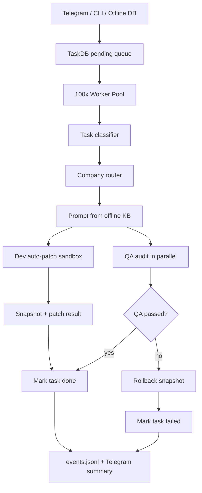

# Super Agent Offline 100x

## Mục tiêu

`prototypes/super_agent_offline_100x.py` là prototype nâng cao cho workflow siêu agent tự động:

- Tự động nhận task từ offline DB `.super-agent-100x/task_db.json`.
- Scale multi-company bằng worker pool, tối đa 32 worker local.
- Dev và QA chạy song song cho mỗi task.
- Auto-patch có snapshot và rollback, nhưng chỉ trong sandbox `.super-agent-100x/workspace/`.
- Telegram adapter vẫn là tùy chọn để nhận lệnh và trả feedback.

## Kiến trúc



## File chính

```txt
prototypes/super_agent_offline_100x.py
.super-agent-100x/task_db.json
.super-agent-100x/workspace/
.super-agent-100x/snapshots/
.super-agent-100x/logs/events.jsonl
```

`.super-agent-100x/` là runtime state, không cần commit.

## Chạy thử một task

```bash
python3 prototypes/super_agent_offline_100x.py \
  --task "Fix bug module payment" \
  --once
```

Task sẽ được thêm vào DB offline, route về company phù hợp, Dev patch vào sandbox, QA audit song song, sau đó task được mark `done` hoặc `failed`.

## Thêm patch cụ thể

Patch chỉ được phép trỏ vào `.super-agent-100x/workspace/`.

```bash
python3 prototypes/super_agent_offline_100x.py \
  --task "Update sandbox payment note" \
  --patch '{"target":"payment/notes.md","mode":"replace","content":"offline patch content"}' \
  --once
```

## Monitor DB liên tục

```bash
python3 prototypes/super_agent_offline_100x.py --monitor --interval 5
```

Có thể thêm task vào `.super-agent-100x/task_db.json` với dạng tối thiểu:

```json
[
  {
    "id": "task-manual-001",
    "desc": "Audit deployment risk",
    "status": "pending"
  }
]
```

## Telegram adapter

Telegram không bật mặc định.

```bash
export TELEGRAM_BOT_TOKEN="..."
python3 prototypes/super_agent_offline_100x.py --telegram --monitor
```

Adapter chỉ queue task vào DB local. Monitor offline xử lý phần còn lại.

## Rollback test

Thêm `[qa-fail]` vào mô tả task để ép QA fail và kiểm tra rollback.

```bash
python3 prototypes/super_agent_offline_100x.py \
  --task "Fix parser [qa-fail]" \
  --patch '{"target":"parser/demo.md","mode":"replace","content":"bad patch"}' \
  --once
```

## Policy

- Không hardcode Telegram token.
- Không patch production source từ prototype này.
- Mọi mutation đều nằm trong `.super-agent-100x/workspace/`.
- Mỗi patch có snapshot nếu file đã tồn tại.
- QA fail thì rollback tự động.
- Muốn áp dụng vào source thật cần approval gate riêng, test suite, và rollback strategy cấp repo.

## Verify trước khi sync main

```bash
python3 -m py_compile prototypes/super_agent_offline_100x.py
python3 prototypes/super_agent_offline_100x.py --task "Fix bug module payment" --once
npm test
npm run build
npm run lint
npm run test:integration
```

## Next steps

- Thêm SQLite backend thay cho JSON DB khi cần concurrency mạnh hơn.
- Thêm approval gate để promote patch từ sandbox vào repo thật.
- Nối events vào UI Command Center.
- Thêm scheduler đọc task từ source offline khác.
- Thêm test harness riêng cho rollback, DB claim, Telegram queue.
