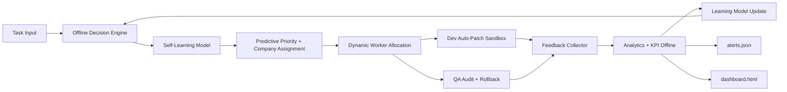

# Super Agent Offline AI Self-Learning

## Mục tiêu

`prototypes/super_agent_offline_ai_selflearning.py` mở rộng AI decision layer thành prototype tự học offline:

- Self-learning model cập nhật từ analytics history.
- Predictive priority dựa trên task type, SLA, impact, company risk, task-type risk và global KPI.
- Dynamic worker allocation dựa trên throughput/risk history.
- Scenario simulation để dự đoán bottleneck trước khi chạy thật.
- Dev/QA song song, sandbox patch, rollback khi QA fail.
- Explainability: mỗi event có decision record, learning signals, predicted risk và allocated workers.
- Analytics, alerts, dashboard, model state hoàn toàn local.

## Kiến trúc



## Runtime state

```txt
.super-agent-selflearning/task_db.json
.super-agent-selflearning/workspace/
.super-agent-selflearning/snapshots/
.super-agent-selflearning/logs/events.jsonl
.super-agent-selflearning/analytics.json
.super-agent-selflearning/alerts.json
.super-agent-selflearning/dashboard.html
.super-agent-selflearning/learning_model.json
.super-agent-selflearning/simulation_report.json
```

Không commit `.super-agent-selflearning/`; đây là state local.

## Chạy thử

```bash
python3 prototypes/super_agent_offline_ai_selflearning.py \
  --task "Fix payment SLA production bug" \
  --once
```

## Batch predictive decision

```bash
python3 prototypes/super_agent_offline_ai_selflearning.py \
  --task "Fix payment SLA production bug" \
  --task "Audit deployment compliance risk" \
  --task "Generate monthly marketing report" \
  --once
```

## Rollback test

```bash
python3 prototypes/super_agent_offline_ai_selflearning.py \
  --task "Fix parser [qa-fail]" \
  --patch '{"target":"parser/demo.md","mode":"replace","content":"bad patch"}' \
  --once
```

## Scenario simulation

Simulation không mutate workspace và không mark task done; nó chỉ tạo decision report:

```bash
python3 prototypes/super_agent_offline_ai_selflearning.py \
  --simulate \
  --task "Fix auth security regression before customer deadline" \
  --task "Audit deployment compliance risk" \
  --task "Generate monthly marketing report"
```

Kết quả nằm ở:

```txt
.super-agent-selflearning/simulation_report.json
```

## Dashboard và model

```bash
python3 prototypes/super_agent_offline_ai_selflearning.py --dashboard
```

File local:

```txt
.super-agent-selflearning/dashboard.html
.super-agent-selflearning/learning_model.json
```

## Telegram adapter

```bash
export TELEGRAM_BOT_TOKEN="..."
python3 prototypes/super_agent_offline_ai_selflearning.py --telegram --monitor
```

Lệnh Telegram:

```txt
Fix payment SLA production bug
/kpi
```

## Learning signals

Model học từ:

- QA fail rate theo company.
- Rollback rate theo company.
- Review-required rate theo company.
- Dev success rate theo company.
- Risk score theo task type.
- Global QA fail/rollback/review rate.

Decision record có:

- `predicted_risk`
- `allocated_workers`
- `learning_signals`
- `company_scores`
- lý do tăng/giảm priority

## Verify trước khi sync main

```bash
python3 -m py_compile prototypes/super_agent_offline_ai_selflearning.py
python3 prototypes/super_agent_offline_ai_selflearning.py --task "Fix payment SLA production bug" --once
python3 prototypes/super_agent_offline_ai_selflearning.py --task "Fix parser [qa-fail]" --patch '{"target":"parser/demo.md","mode":"replace","content":"bad patch"}' --once
python3 prototypes/super_agent_offline_ai_selflearning.py --simulate --task "Fix auth security regression before customer deadline" --task "Audit deployment compliance risk"
python3 prototypes/super_agent_offline_ai_selflearning.py --dashboard
npm test
npm run build
npm run lint
npm run test:integration
```

## Chính sách an toàn

- Không hardcode Telegram token.
- Không patch production source từ prototype này.
- Auto-patch chỉ ghi trong `.super-agent-selflearning/workspace/`.
- QA fail thì rollback tự động.
- Self-learning model là local heuristic, không gọi cloud model.
- Promotion từ sandbox vào repo thật phải đi qua approval gate riêng.
