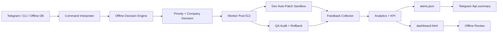

# Super Agent Offline AI Decision

## Mục tiêu

`prototypes/super_agent_offline_ai.py` thêm lớp AI decision-making offline trên nền Super Agent 10.000x:

- Tự đánh giá task priority dựa trên task type, SLA term, impact domain và KPI history.
- Tự phân bổ company dựa trên skill match, workload hiện tại, QA fail history và rollback history.
- Dev/QA chạy song song.
- Sandbox auto-patch + rollback khi QA fail.
- Analytics, alerts và dashboard hoàn toàn local.
- Telegram adapter tùy chọn, hỗ trợ `/kpi`.

## Kiến trúc



## Decision inputs

Priority engine dùng:

- Task type: `build_fix`, `audit`, `report`, `plan`.
- Explicit labels: `[critical]`, `[high]`, `[medium]`, `[low]`.
- Impact terms: `payment`, `auth`, `security`, `ledger`, `deploy`, `token`, `secret`.
- SLA/customer terms: `sla`, `deadline`, `customer`, `production`, `revenue`.
- Recent QA/rollback instability từ analytics history.

Company assignment dùng:

- Keyword skill match theo company profile.
- Workload 100 task gần nhất.
- Reliability penalty từ 200 event gần nhất.
- Priority bonus cho `IT_AI` và `Legal_Compliance` khi task high/critical.

Mỗi event có `decision` record để dev/QA audit lại lý do phân bổ.

## Runtime state

```txt
.super-agent-ai/task_db.json
.super-agent-ai/workspace/
.super-agent-ai/snapshots/
.super-agent-ai/logs/events.jsonl
.super-agent-ai/analytics.json
.super-agent-ai/alerts.json
.super-agent-ai/dashboard.html
```

Không commit `.super-agent-ai/`; đây là state local.

## Chạy thử

```bash
python3 prototypes/super_agent_offline_ai.py \
  --task "Fix payment SLA production bug" \
  --once
```

## Chạy batch decision

```bash
python3 prototypes/super_agent_offline_ai.py \
  --task "Generate monthly marketing report" \
  --task "Audit deployment compliance risk" \
  --task "Fix auth security regression before customer deadline" \
  --once
```

## Rollback test

```bash
python3 prototypes/super_agent_offline_ai.py \
  --task "Fix parser [qa-fail]" \
  --patch '{"target":"parser/demo.md","mode":"replace","content":"bad patch"}' \
  --once
```

## Dashboard

```bash
python3 prototypes/super_agent_offline_ai.py --dashboard
```

Mở file:

```txt
.super-agent-ai/dashboard.html
```

## Telegram adapter

```bash
export TELEGRAM_BOT_TOKEN="..."
python3 prototypes/super_agent_offline_ai.py --telegram --monitor
```

Lệnh Telegram:

```txt
Fix payment SLA production bug
/kpi
```

## Verify trước khi sync main

```bash
python3 -m py_compile prototypes/super_agent_offline_ai.py
python3 prototypes/super_agent_offline_ai.py --task "Fix payment SLA production bug" --once
python3 prototypes/super_agent_offline_ai.py --task "Fix parser [qa-fail]" --patch '{"target":"parser/demo.md","mode":"replace","content":"bad patch"}' --once
python3 prototypes/super_agent_offline_ai.py --dashboard
npm test
npm run build
npm run lint
npm run test:integration
```

## Chính sách an toàn

- Không hardcode Telegram token.
- Không patch production source từ prototype này.
- Auto-patch chỉ ghi trong `.super-agent-ai/workspace/`.
- QA fail thì rollback tự động.
- Decision engine là heuristic offline có explainability, chưa phải model tự học.
- Promotion từ sandbox vào repo thật phải đi qua approval gate riêng.
