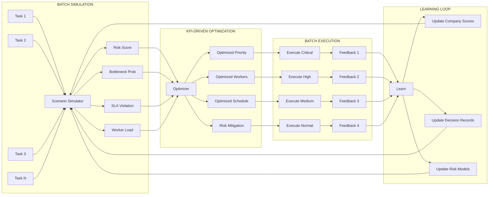
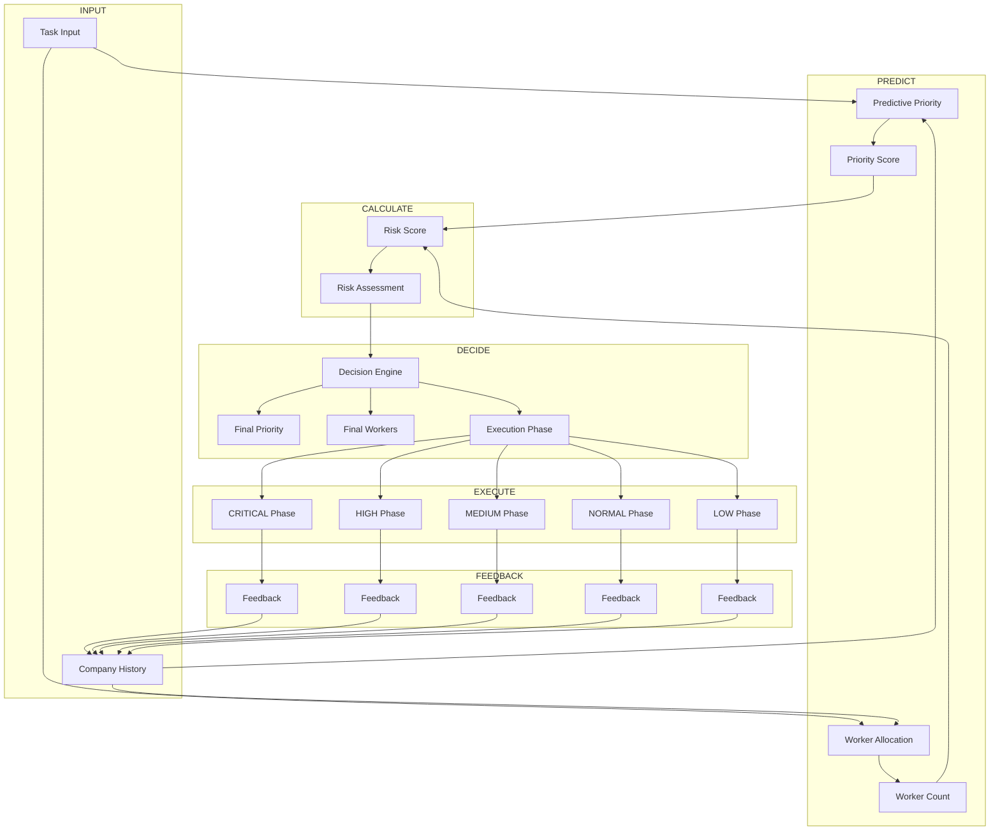

# SUPER AGENT OFFLINE FULL AUTONOMOUS + KPI-DRIVEN OPTIMIZATION

## 1. Mục tiêu

- Offline self-learning + predictive priority
- Dynamic worker allocation
- Proactive batch planning + scenario simulation
- Dev/QA song song, sandbox patch + rollback QA fail
- Offline Analytics, KPI, Alerts, Dashboard
- Telegram adapter: /kpi, /plan, /status, /alerts, /risk
- Full explainability & audit trail

## 2. Cấu trúc

```
prototypes/
└── super_agent_offline_fullauto_kpi.py    # Main prototype

.super-agent-fullauto-kpi/
├── task_db.json              # Task database
├── workspace/                # Patch files
├── logs/                    # Log files
├── analytics.json            # Analytics data
├── alerts.json              # Alert records
├── dashboard.html            # HTML dashboard
├── execution_summary.json    # Execution history
├── simulation_report.json    # Simulation results
├── autonomous_plan.json      # Execution plan
├── company_scores.json       # Company statistics
├── decision_log.json         # Decision audit trail
├── risk_report.json          # Risk predictions
└── sla_prediction.json       # SLA predictions

kb/
└── super-agent-offline-fullauto-kpi.md    # Knowledge base

docs/devops/
└── super-agent-offline-fullauto-kpi.md     # This file
```

## 3. Hướng dẫn chạy

### 3.1. Cài đặt dependencies

```bash
pip3 install python-telegram-bot
```

### 3.2. Cấu hình Telegram Token

Mở file `prototypes/super_agent_offline_fullauto_kpi.py` và cập nhật:

```python
TELEGRAM_TOKEN = "YOUR_TELEGRAM_BOT_TOKEN"
```

### 3.3. Chạy hệ thống

```bash
cd prototypes
python3 super_agent_offline_fullauto_kpi.py
```

### 3.4. Sử dụng Telegram Bot

Gửi message đến bot:

- `/start` - Welcome message
- `/kpi` - KPI report
- `/plan` - Autonomous execution plan
- `/status` - System status
- `/alerts` - Recent alerts
- `/risk` - Risk report
- Any text - Tạo task mới

### 3.5. Sử dụng offline (không Telegram)

```python
from super_agent_offline_fullauto_kpi import (
    add_task,
    route_tasks_batch,
    load_json,
    ANALYTICS_PATH
)

# Thêm task
task = {
    "desc": "Fix payment bug",
    "task_type": "bug",
    "assigned_company": "Company_1",
    "sla_deadline": "2026-05-20T12:00:00"
}
add_task(task)

# Xử lý batch
route_tasks_batch([task])

# Kiểm tra analytics
analytics = load_json(ANALYTICS_PATH, [])
print(f"Total tasks: {len(analytics)}")
```

## 4. Workflow Diagram

```mermaid
flowchart TB
    subgraph INPUT["INPUT LAYER"]
        A[Task Input]
        A1[Telegram/CLI/API]
        A2[JSON Task DB]
    end

    subgraph DECISION["SELF-LEARNING DECISION ENGINE"]
        B[Analytics History]
        C[Company Statistics]
        D[Decision Records]
        B --> E[Self-Learning Update]
        C --> E
        D --> E
        E --> F[Predictive Priority]
        F --> G[Dynamic Worker Allocation]
    end

    subgraph SCHEDULE["BATCH SCHEDULER & SIMULATION"]
        H[Batch Scheduler]
        I[Scenario Simulation]
        J[Bottleneck Prediction]
        K[SLA Prediction]
        L[Autonomous Plan]
        M[Risk Report]
        H --> I
        I --> J
        I --> K
        J --> L
        K --> M
    end

    subgraph EXECUTE["EXECUTION ENGINE"]
        N[Execute Task]
        O[Dev Handler]
        P[QA Handler]
        Q[Patch Sandbox]
        R[QA Rollback]
        N -->|Parallel| O
        N -->|Parallel| P
        O --> Q
        P -->|QA_FAIL| R
        R --> Q
    end

    subgraph FEEDBACK["FEEDBACK & LEARNING"]
        S[Collect Feedback]
        T[Update Analytics]
        U[Generate Dashboard]
        V[Generate Alerts]
        W[Update Execution Summary]
        X[Learn & Adapt]
        Q --> S
        R --> S
        S --> T
        T --> U
        T --> V
        T --> W
        W --> X
    end

    subgraph OUTPUT["OUTPUT & REPORTING"]
        Y[Dashboard HTML]
        Z[Alerts JSON]
        AA[Execution Summary]
        AB[Simulation Report]
        AC[Risk Report]
        AD[Autonomous Plan]
    end

    subgraph TELEGRAM["TELEGRAM ADAPTER"]
        AE[/kpi]
        AF[/plan]
        AG[/status]
        AH[/alerts]
        AI[/risk]
        AE --> T
        AF --> L
        AG --> N
        AH --> V
        AI --> M
    end

    A -->|Add Task| H
    A1 -->|Command| AE
    A1 -->|Command| AF
    A1 -->|Command| AG
    A1 -->|Command| AH
    A1 -->|Command| AI
    H --> G
    L --> N
    M --> N
    U --> Y
    V --> Z
    W --> AA
    I --> AB
    X --> D
```

## 5. Multi-Batch Proactive Simulation Diagram



## 6. KPI-Driven Allocation Flow



## 7. Features chi tiết

### 7.1. Self-Learning Engine

- Cập nhật company statistics từ analytics data
- Tính QA fail rate, rollback rate, task count
- Tính risk score dựa trên historical performance
- Lưu vào `company_scores.json`

### 7.2. Predictive Priority

- Base priority mapping theo task type:
  - `bug` → critical
  - `payment` → high
  - `hotfix` → critical
  - `audit` → medium
  - `report` → normal
  - `feature` → low
- Boost priority nếu company có high failure rate
- Check SLA urgency

### 7.3. Dynamic Worker Allocation

- Base workers theo priority:
  - CRITICAL: 8 workers
  - HIGH: 4 workers
  - MEDIUM: 2 workers
  - NORMAL/LOW: 1 worker
- Adjust dựa trên company performance
- Extra workers cho high-risk companies

### 7.4. Batch Scheduler & Simulation

- Sort tasks by priority và risk
- Run scenario simulation
- Generate bottleneck predictions
- Predict SLA violations
- Generate autonomous execution plan

### 7.5. Dev/QA Parallel Processing

- Parallel Dev và QA threads
- Sandbox patch application
- Automatic rollback on QA fail
- Retry mechanism (up to 3 retries)

### 7.6. Analytics & Reporting

- Dashboard HTML với metrics
- Alerts JSON cho failures
- Execution summary
- Risk report
- SLA prediction

### 7.7. Telegram Commands

| Command | Description |
|---------|-------------|
| `/start` | Welcome message |
| `/kpi` | KPI report |
| `/plan` | Autonomous execution plan |
| `/status` | System status |
| `/alerts` | Recent alerts |
| `/risk` | Risk report |

## 8. Metrics

### System Metrics
- Total Tasks
- Success Rate
- Dev Failures
- QA Failures

### Company Metrics
- QA Fail Rate
- Rollback Rate
- Task Count
- Average Completion Time
- Risk Score

## 9. Thresholds

| Threshold | Value | Description |
|-----------|-------|-------------|
| BOTTLENECK_THRESHOLD | 0.7 | Ngưỡng bottleneck |
| SLA_VIOLATION_THRESHOLD | 0.3 | Ngưỡng SLA violation |
| MAX_WORKERS | 512 | Tối đa workers |

## 10. Sync vào main

1. Pull main:
   ```bash
   git pull origin main
   ```

2. Commit all files:
   ```bash
   git add prototypes/super_agent_offline_fullauto_kpi.py
   git add .super-agent-fullauto-kpi/
   git add kb/super-agent-offline-fullauto-kpi.md
   git add docs/devops/super-agent-offline-fullauto-kpi.md
   git commit -m "feat: Full Autonomous Corporate Agent v2.0 with KPI-driven optimization"
   ```

3. Push main:
   ```bash
   git push origin main
   ```

4. QA verify workflow, merge release

## 11. Monitoring

### Dashboard
```bash
open .super-agent-fullauto-kpi/dashboard.html
```

### Logs
```bash
tail -f .super-agent-fullauto-kpi/logs/agent_$(date +%Y%m%d).log
```

### Analytics
```bash
cat .super-agent-fullauto-kpi/analytics.json | jq
```

### Alerts
```bash
cat .super-agent-fullauto-kpi/alerts.json | jq
```

## 12. Troubleshooting

### Telegram Bot Not Starting
1. Kiểm tra TELEGRAM_TOKEN
2. Cài đặt: `pip install python-telegram-bot`

### Dashboard Not Updating
1. Kiểm tra analytics.json có dữ liệu
2. Kiểm tra quyền ghi file

### Tasks Not Executing
1. Kiểm tra task_db.json
2. Kiểm tra auto_task_monitor đang chạy
3. Xem logs trong `.super-agent-fullauto-kpi/logs/`

## 13. Performance Tips

1. **Batch Processing**: Thêm nhiều tasks cùng lúc để tận dụng batch scheduler
2. **Worker Pool**: Điều chỉnh MAX_WORKERS phù hợp với hệ thống
3. **Analytics Retention**: Giới hạn 10000 entries để tránh đầy bộ nhớ
4. **Decision Log**: Giữ 10000 decisions để học hiệu quả