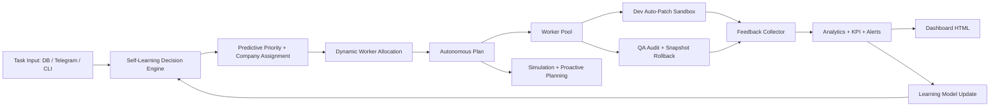

# Super Agent Offline Full Autonomous

## Mục tiêu

`prototypes/super_agent_offline_fullauto.py` là lớp orchestration cuối trên self-learning agent:

- Tự phân tích task mới từ offline DB hoặc Telegram.
- Tự đánh giá priority bằng self-learning model, predictive risk và KPI history.
- Tự phân bổ company/team theo skill match, workload, QA fail/rollback history.
- Tự phân bổ worker pool theo dynamic allocation.
- Tự trigger Dev/QA song song, sandbox patch, rollback nếu QA fail.
- Tự giám sát KPI + alerts, update dashboard và alerts offline.
- Scenario simulation và proactive planning để dự đoán bottleneck/resource pressure.
- Decision explainability cho audit: predicted risk, allocated workers, learning signals, company scores.

## Kiến trúc



## Runtime state

```txt
.super-agent-fullauto/task_db.json
.super-agent-fullauto/workspace/
.super-agent-fullauto/snapshots/
.super-agent-fullauto/logs/events.jsonl
.super-agent-fullauto/analytics.json
.super-agent-fullauto/alerts.json
.super-agent-fullauto/dashboard.html
.super-agent-fullauto/learning_model.json
.super-agent-fullauto/simulation_report.json
.super-agent-fullauto/autonomous_plan.json
.super-agent-fullauto/execution_summary.json
```

Không commit `.super-agent-fullauto/`; đây là state local.

## Chạy một autonomous cycle

```bash
python3 prototypes/super_agent_offline_fullauto.py \
  --task "Fix payment SLA production bug" \
  --task "Audit deployment compliance risk" \
  --task "Generate monthly marketing report" \
  --once
```

## Dry run plan

Dry run tạo plan nhưng không patch workspace và không mark task done:

```bash
python3 prototypes/super_agent_offline_fullauto.py \
  --task "Fix payment SLA production bug" \
  --task "Audit deployment compliance risk" \
  --dry-run
```

## Rollback test

```bash
python3 prototypes/super_agent_offline_fullauto.py \
  --task "Fix parser [qa-fail]" \
  --patch '{"target":"parser/demo.md","mode":"replace","content":"bad patch"}' \
  --once
```

## Scenario simulation

Simulation không queue task và không mutate workspace:

```bash
python3 prototypes/super_agent_offline_fullauto.py \
  --simulate \
  --task "Fix auth security regression before customer deadline" \
  --task "Audit deployment compliance risk" \
  --task "Generate monthly marketing report"
```

## Monitor DB liên tục

```bash
python3 prototypes/super_agent_offline_fullauto.py --monitor --interval 1
```

## Telegram adapter

```bash
export TELEGRAM_BOT_TOKEN="..."
python3 prototypes/super_agent_offline_fullauto.py --telegram --monitor
```

Lệnh Telegram:

```txt
Fix payment SLA production bug
/kpi
/plan
```

## Artifacts

- `autonomous_plan.json`: planned priority/company/resource strategy.
- `execution_summary.json`: processed events and model stats for the cycle.
- `simulation_report.json`: proactive scenario planning.
- `analytics.json`, `alerts.json`, `dashboard.html`: local KPI surface.

## Verify trước khi sync main

```bash
python3 -m py_compile prototypes/super_agent_offline_fullauto.py
python3 prototypes/super_agent_offline_fullauto.py --task "Fix payment SLA production bug" --once
python3 prototypes/super_agent_offline_fullauto.py --task "Fix parser [qa-fail]" --patch '{"target":"parser/demo.md","mode":"replace","content":"bad patch"}' --once
python3 prototypes/super_agent_offline_fullauto.py --simulate --task "Fix auth security regression before customer deadline" --task "Audit deployment compliance risk"
npm test
npm run build
npm run lint
npm run test:integration
```

## Chính sách an toàn

- Không hardcode Telegram token.
- Không patch production source từ prototype này.
- Auto-patch chỉ ghi trong `.super-agent-fullauto/workspace/`.
- QA fail thì rollback tự động.
- Full autonomous mode vẫn là local heuristic/prototype, không gọi cloud model.
- Promotion từ sandbox vào repo thật phải đi qua approval gate riêng.
